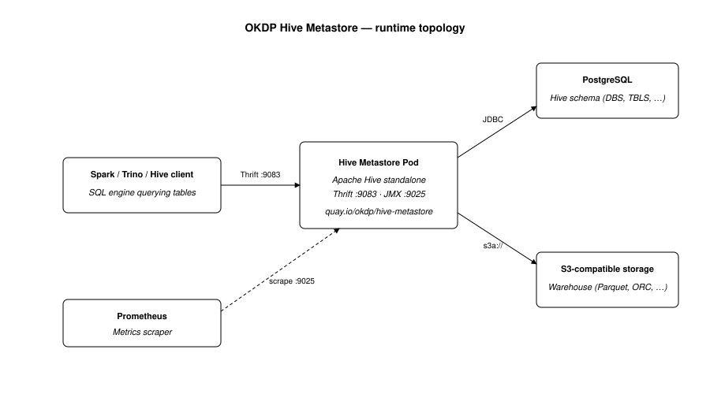

<a href="https://hive.apache.org/" target="_blank">
  
</a>

[](https://github.com/OKDP/hive-metastore/actions/workflows/ci.yml)
[](https://github.com/OKDP/hive-metastore/actions/workflows/release-please.yml)
[](https://github.com/OKDP/hive-metastore/releases/latest)
[](http://www.apache.org/licenses/LICENSE-2.0)
<a href="https://okdp.io">
  
</a>

# OKDP Hive Metastore

Docker image and Helm chart to deploy **Apache Hive Metastore** on Kubernetes. The Hive Metastore is the central metadata catalog of the Hadoop / Spark ecosystem: it lets Spark, Trino and Hive query tables stored on object storage. Intended for data teams running a lakehouse on Kubernetes who need a shared metadata service across their SQL engines.

## What the project does

- Deploys Apache Hive Metastore in **standalone** mode on Kubernetes through a ready-to-use Helm chart and a custom Docker image ([`docker/Dockerfile`](docker/Dockerfile), [`helm/hive-metastore/`](helm/hive-metastore/)).
- Supports both **Hive 3.x** (`hive-standalone-metastore`) and **Hive 4.x** (`hive-standalone-metastore-server`) through the Dockerfile selector at [`docker/Dockerfile#L60-L64`](docker/Dockerfile#L60-L64). CI currently builds the versions listed in [`docker/metastore_4x.version`](docker/metastore_4x.version) (`4.0.1`).
- Initialises the database schema automatically on install and upgrade. The chart ships a Job ([`helm/hive-metastore/templates/job.yaml`](helm/hive-metastore/templates/job.yaml)) registered as a `post-install` / `post-upgrade` Helm hook in [`helm/hive-metastore/values.yaml`](helm/hive-metastore/values.yaml) (`initJob.annotations`). The Job runs `schematool -initSchema` ([`docker/metastore.sh#L304-L314`](docker/metastore.sh#L304-L314)) when the `DBS` table is missing.
- Bundles the **PostgreSQL JDBC driver 42.7.7** and the **MySQL connector 8.0.25** ([`docker/Dockerfile#L21-L22`](docker/Dockerfile#L21-L22)) — both backends are supported via `db.driverName`.
- Exposes JVM metrics in Prometheus format on port **9025** ([`docker/Dockerfile#L26`](docker/Dockerfile#L26), [`docker/config.yaml`](docker/config.yaml)) via the [`jmx_prometheus_javaagent`](https://github.com/prometheus/jmx_exporter) Java agent.
- Restricts inbound access to the Thrift port **9083** by default through a Kubernetes `NetworkPolicy` ([`helm/hive-metastore/templates/networkpolicy.yaml`](helm/hive-metastore/templates/networkpolicy.yaml), enabled by default in [`values.yaml`](helm/hive-metastore/values.yaml) — `networkPolicies.enabled: true`). The chart ships with no authentication enabled by default.
- Builds multi-architecture images for **`linux/amd64`** and **`linux/arm64`** ([`.github/workflows/docker-build-test-push-template.yml#L138`](.github/workflows/docker-build-test-push-template.yml#L138)).

## Components

| Artifact | Registry | Description |
|---|---|---|
| Docker image | [`quay.io/okdp/hive-metastore`](https://quay.io/repository/okdp/hive-metastore) | Apache Hive standalone metastore, PostgreSQL/MySQL JDBC drivers, S3A connector and JMX Prometheus exporter. Multi-arch `linux/amd64` and `linux/arm64`. Currently published tags: `4.0.1`, `4.0.1-1.4.0`. |
| Helm chart | [`quay.io/okdp/charts/hive-metastore`](https://quay.io/repository/okdp/charts/hive-metastore) | Deployment, init Job, NetworkPolicy, HPA, ServiceAccount, Service and ConfigMap (optional, for `configOverrides`). Current version `1.4.0`. |

## Architecture

<p align="center">
  
</p>

## Prerequisites

- Kubernetes cluster (>= 1.19)
- [Helm](https://helm.sh/) >= 3
- A **PostgreSQL** server reachable from the cluster, with an empty database (the chart's init Job creates the schema automatically)
- An **S3** endpoint reachable from the cluster (AWS S3 or S3-compatible — e.g. SeaweedFS)
- Two Kubernetes Secrets: one for the database password, one for the S3 access key and secret key

## Quick Start

The chart cannot be installed standalone — it requires a PostgreSQL server, an S3 endpoint and Kubernetes Secrets holding their credentials. The quickest way to try it is the **OKDP sandbox**, which pre-wires PostgreSQL (CloudNativePG), S3 (SeaweedFS) and `hive-metastore` on a local Kind cluster:

```sh
git clone https://github.com/OKDP/okdp-sandbox.git
cd okdp-sandbox
# Follow the sandbox README (Kind + Flux + KuboCD)
```

### Expected result

Once the sandbox is up, the metastore is reachable inside the cluster on its Thrift endpoint (port `9083`), and the init Job has completed schema creation.

## Installation

Install on an existing cluster, against a managed PostgreSQL and an S3-compatible endpoint, using a `values.yaml` file that holds the configuration described in the next section:

```sh
helm install my-release oci://quay.io/okdp/charts/hive-metastore \
  --version 1.4.0 \
  --namespace hive-metastore --create-namespace \
  -f values.yaml
```

### Expected result

```
$ kubectl -n hive-metastore get pods
NAME                       READY   STATUS      AGE
my-release-hive-...        1/1     Running     1m
my-release-hive-...        1/1     Running     1m
my-release-hive-...        0/1     Completed   1m

$ kubectl -n hive-metastore logs job/my-release-hive-metastore
DATABASE SCHEMA SHOULD BE OK NOW!!
```

## Configuration

The full chart values reference is in the [Helm chart README](helm/hive-metastore/README.md). The parameters most commonly customised are listed below — items marked _(required)_ have no default and must be set for the chart to start.

| Parameter | Description | Default |
|---|---|---|
| `db.driverName` | JDBC driver: `postgresql` or `mysql` | `postgresql` |
| `db.host` | Database server hostname | _(required)_ |
| `db.port` | Database server port | `5432` |
| `db.databaseName` | Database name | `hms` |
| `db.user.name` | Database user | `hms` |
| `db.user.password.secretName` | Kubernetes Secret holding the database password | _(required)_ |
| `db.user.password.propertyName` | Key of the password inside the Secret | _(required)_ |
| `s3.url` | S3 endpoint (e.g. `https://s3.amazonaws.com`, `http://seaweedfs:8333`) | _(required)_ |
| `s3.warehouseDirectory` | S3 bucket used as the Hive warehouse | _(required)_ |
| `s3.accessKey.secretName` | Kubernetes Secret holding the S3 access key | _(required)_ |
| `s3.secretKey.secretName` | Kubernetes Secret holding the S3 secret key | _(required)_ |
| `replicaCount` | Number of metastore pods | `2` |
| `networkPolicies.enabled` | Enable the NetworkPolicy restricting access to port 9083 | `true` |
| `image.repository` | Docker image repository | `quay.io/okdp/hive-metastore` |
| `image.tag` | Image tag (override with a published version, e.g. `4.0.1`) | `latest` |

## OKDP integration

`hive-metastore` is integrated into the OKDP sandbox as the shared metadata catalog used by Spark, Trino and Superset. It is deployed declaratively through KuboCD:

- [`okdp-sandbox/packages/okdp-packages/hive-metastore`](https://github.com/OKDP/okdp-sandbox/tree/main/packages/okdp-packages/hive-metastore)

## Build

A `Makefile` provides local build targets for development. The default `make docker` builds the image from a pre-downloaded Hive Metastore tarball ([`docker/Dockerfile-download`](docker/Dockerfile-download)). The CI workflow builds from [`docker/Dockerfile`](docker/Dockerfile) and publishes to `quay.io/okdp/hive-metastore`.

```sh
make docker
```

### Expected result

The image is built locally and tagged as `quay.io/okdp/hive-metastore:<IMAGE_TAG>` using the variables defined at the top of the `Makefile` (default `IMAGE_TAG=3.1.3`). By default the target also pushes to the registry — comment out the `DOCKER_PUSH := --push` line for a build-only run.

## Test

Lint the Helm chart and run installation tests on a Kind cluster, using the configuration in [`.ct.yml`](.ct.yml):

```sh
helm lint helm/hive-metastore
ct install --config .ct.yml
```

### Expected result

```
==> Linting helm/hive-metastore
[INFO] Chart.yaml: icon is recommended

1 chart(s) linted, 0 chart(s) failed
```

The full CI pipeline runs on every pull request via [`.github/workflows/ci.yml`](.github/workflows/ci.yml): Docker build for each version in [`docker/metastore_4x.version`](docker/metastore_4x.version), Helm lint, `chart-testing` installation on Kind, and image vulnerability scan via [`.github/workflows/trivy.yml`](.github/workflows/trivy.yml). The image is rebuilt weekly through [`.github/workflows/docker-rebuild.yml`](.github/workflows/docker-rebuild.yml) to pick up upstream base image security patches.

## License

[Apache License 2.0](LICENSE)

---

**Built 🚀 for the OKDP Community**
<a href="https://okdp.io">
  
</a>
